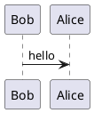

# *PlantUML* Builder


## Introduction


This script can upload [***PlantUML***](https://plantuml.com) scripts to the *PlantUML* server and download the built diagrams.

## Usage

### Example 1

The following command uploads the `hello.puml` file to the *PlantUML* server, then downloads the `hello.png` diagram to the source directory.

```console
PS> .\Build-PlantUML.ps1 -File 'hello.puml'
```



For example, the above script `hello.puml` will be built as `hello.png`.


### Example 2

The following command uploads the `hello.puml` file to the *PlantUML* server, then downloads the `hello.svg` diagram to the source directory.

```console
PS> .\Build-PlantUML.ps1 -File 'hello.puml' -DiagramExtension 'svg'
```

### Example 3

The following command sends all `.puml` files in the `docs` directory to the *PlantUML* server, then downloads `.png` diagrams to the source directory.

```console
PS> .\Build-PlantUML.ps1 -Directory 'docs'
```

### Example 4

This command uploads all `.txt` files in the current directory and its subdirectories to the *PlantUML* server, then downloads `.svg` diagrams to the source directories.

```console
PS> .\Build-PlantUML.ps1 -Recurse -ScriptExtension 'txt' -DiagramExtension 'svg'
```

## License

Distributed under the *MIT License*. See `LICENSE` for more information.